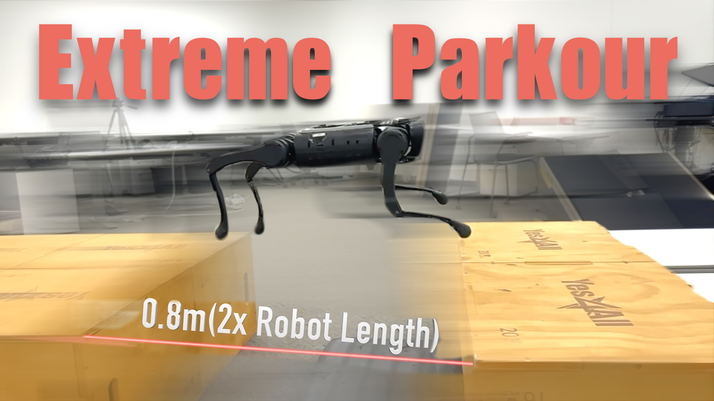

# Extreme Parkour with Legged Robots #
<p align="center">

</p>

**Authors**: [Xuxin Cheng*](https://chengxuxin.github.io/), [Kexin Shi*](https://tenhearts.github.io/), [Ananye Agarwal](https://anag.me/), [Deepak Pathak](https://www.cs.cmu.edu/~dpathak/)  
**Website**: https://extreme-parkour.github.io  
**Paper**: https://arxiv.org/abs/2309.14341  
**Tweet Summary**: https://twitter.com/pathak2206/status/1706696237703901439

### Installation ###
```bash
conda create -n parkour python=3.8
conda activate parkour
cd
pip3 install torch==1.10.0+cu113 torchvision==0.11.1+cu113 torchaudio==0.10.0+cu113 -f https://download.pytorch.org/whl/cu113/torch_stable.html
git clone git@github.com:chengxuxin/extreme-parkour.git
cd extreme-parkour
# Download the Isaac Gym binaries from https://developer.nvidia.com/isaac-gym 
# Originally trained with Preview3, but haven't seen bugs using Preview4.
cd isaacgym/python && pip install -e .
cd ~/extreme-parkour/rsl_rl && pip install -e .
cd ~/extreme-parkour/legged_gym && pip install -e .
pip install "numpy<1.24" pydelatin wandb tqdm opencv-python ipdb pyfqmr flask
```

### Usage ###
### For deployment, see 4. and 6. ###
`cd legged_gym/scripts`
1. Train base gait policy(trot, bound, pace, pronk):  
```bash
python train.py 
```
Train 2-3k iterations recommended.

2. Train parkour policy:
```bash
python train.py --parkour_terrains --resume
```

3. Train distillation policy:
```bash
python train.py  --resume --resumeid new  --use_camera
```

4. Play base gait policy:
### the resume policy is model_4800.pt
```bash
python play.py 
```

5. Play parkour policy:
```bash
python play.py --parkour_terrains
```

6. Play distill policy:
### the resume policy is model_5500.pt
```bash
python play.py --exptid new  --use_camera
```
### Trouble shooting
If the process fails to create DepthImage, RGBImage, OpticalImage etc in training distill policy , try to add:
```
os.environ["CUDA_VISIBLE_DEVICES"] = 'n'
```
in scripts/train.py

### Viewer Usage
Can be used in both IsaacGym and web viewer.
- `ALT + Mouse Left + Drag Mouse`: move view.
- `[ ]`: switch to next/prev robot.
- `Space`: pause/unpause.
- `F`: switch between free camera and following camera.

### Arguments
- --exptid: string, can be `xxx-xx-WHATEVER`, `xxx-xx` is typically numbers only. `WHATEVER` is the description of the run. 
- --device: can be `cuda:0`, `cpu`, etc.
- --delay: whether add delay or not.
- --checkpoint: the specific checkpoint you want to load. If not specified load the latest one.
- --resume: resume from another checkpoint, used together with `--resumeid`.
- --seed: random seed.
- --no_wandb: no wandb logging.
- --use_camera: use camera or scandots.
- --web: used for playing on headless machines. It will forward a port with vscode and you can visualize seemlessly in vscode with your idle gpu or cpu. [Live Preview](https://marketplace.visualstudio.com/items?itemName=ms-vscode.live-server) vscode extension required, otherwise you can view it in any browser.

### Acknowledgement
https://github.com/leggedrobotics/legged_gym  
https://github.com/Toni-SM/skrl

### Citation
If you found any part of this code useful, please consider citing:
```
@article{cheng2023parkour,
title={Extreme Parkour with Legged Robots},
author={Cheng, Xuxin and Shi, Kexin and Agarwal, Ananye and Pathak, Deepak},
journal={arXiv preprint arXiv:2309.14341},
year={2023}
}
```
